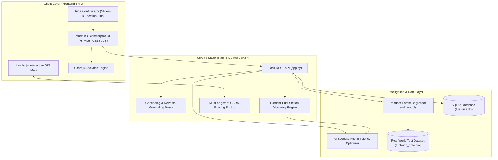
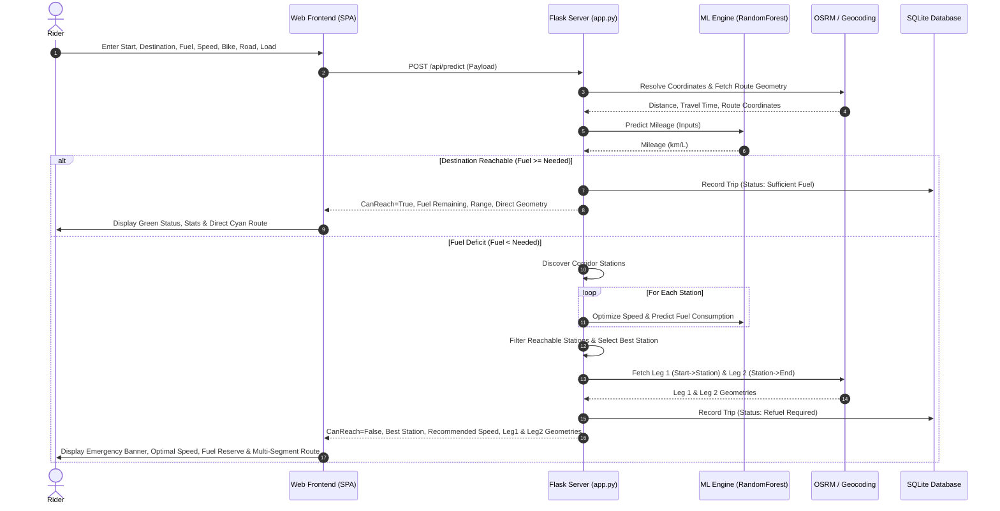

# FuelWise AI: Smart Route, Range & Reachable Fuel Station Optimization System
## Comprehensive Technical Project Report & External Examiner Defense Guide

---

## 1. Executive Summary & Project Abstract

**FuelWise AI** is an intelligent, full-stack decision-support system engineered specifically for two-wheeler motorcycle riders embarking on long-distance, inter-city, and rural journeys. 

### The Core Problem:
Motorcycle riders frequently encounter uncertainty regarding whether their current fuel reserve is sufficient to reach their planned destination. Unlike four-wheelers, many two-wheelers lack advanced onboard digital range computers that take into account rider weight (pillion/luggage), road gradient/type, and cruising speed. Running out of fuel on remote highways or rural stretches poses severe safety risks.

### The Solution:
**FuelWise AI** bridges this gap by combining **Machine Learning (Random Forest Regression)**, **Geographical Information Systems (Leaflet & OpenStreetMap/OSRM)**, and an **Automated Corridor Station Discovery Engine**.
- **Inputs**: Starting Location, Destination, Current Fuel (L), Riding Speed (km/h), Bike Model, Road Classification, and Load Profile.
- **Scenario A (Sufficient Fuel)**: The AI calculates predicted mileage, fuel required, remaining fuel at destination, travel time, and renders the direct route.
- **Scenario B (Fuel Deficit / Emergency)**: The system automatically detects that the destination is unreachable, scans the highway corridor for all accessible fuel stations, determines the **Best Reachable Fuel Station**, computes the **AI-Recommended Cruising Speed** to maximize fuel economy, and plots a multi-segment route:
  $$\text{Current Location} \longrightarrow \text{Reachable Fuel Station} \longrightarrow \text{Original Destination}$$

---

## 2. System Architecture & High-Level Design

The FuelWise AI architecture is designed as a modular 3-tier system:



---

## 3. Detailed Module & Component Breakdown

The project is structured into four primary modules:

### Module 1: Machine Learning & Speed Optimization Engine
- **File**: `app.py`, `ml_model.py`, `fuelwise_data.csv`
- **Core Technology**: `scikit-learn` (`RandomForestRegressor`), `pandas`, `numpy`.
- **Functionality**:
  1. **Dynamic Feature Mapping**: Maps bike models to their calibrated base mileage, encodes road type (Highway vs. Rural), and parses rider load profiles.
  2. **Mileage Prediction**: Non-linear estimation of fuel economy under fluctuating velocities, road terrains, and bike classes.
  3. **Cruising Speed Optimization**: When a fuel emergency occurs or when requested by the rider, the engine iterates through a range of speed curves ($30\text{ km/h} \le v \le 75\text{ km/h}$) to locate the velocity that maximizes fuel economy, thereby extending range to reach safe refueling points.

### Module 2: GIS, Geocoding & Multi-Segment Routing Engine
- **File**: `app.py` (Routing functions), `static/js/main.js`
- **Core Technology**: Project OSRM (Open Source Routing Machine), OpenStreetMap Nominatim, Leaflet.js.
- **Functionality**:
  1. **Geocoding Proxy (`/api/geocode`, `/api/reverse-geocode`)**: Translates place names (e.g., "Mumbai", "Pune", "Thane") into latitude/longitude coordinates with built-in regional presets.
  2. **Direct Route Generation**: Computes driving distance and geometry between coordinates.
  3. **Multi-Segment Route Planner**: In fuel emergency mode, generates two distinct route legs:
     - **Leg 1**: Current Location $\rightarrow$ Best Reachable Fuel Station (rendered in Solid Amber `#f59e0b`).
     - **Leg 2**: Fuel Station $\rightarrow$ Original Destination (rendered in Dashed Violet `#a855f7`).

### Module 3: Highway Corridor Fuel Station Locator
- **File**: `app.py` (`find_candidate_fuel_stations`), `static/js/main.js`
- **Functionality**:
  1. Evaluates fuel pumps in the immediate vicinity and projected along the travel vector.
  2. Evaluates real-time reachability:
     $$F_{\text{available}} \ge \frac{d_{\text{station}}}{M_{\text{pred}}(v)}$$
  3. **Station Scoring Algorithm**: Ranks stations by balancing progress towards the destination and fuel reserve safety margins upon arrival.

### Module 4: Database & User State Management
- **File**: `database.py`, SQLite database `fuelwise.db`
- **Functionality**:
  1. **Bikes Table**: Stores default models (`Hero Splendor`, `Honda Shine`, `Bajaj Pulsar 150`, `TVS Apache`) and custom user motorcycles added via "My Garage".
  2. **Trips Table**: Logs all calculated journeys, speeds, road types, predicted ranges, fuel requirements, and status.
  3. **Refuel Logs Table**: Tracks actual petrol purchases, price per liter, odometer readings, and costs for financial analytics.

---

## 4. Mathematical Model & Optimization Formulation

The core calculations of FuelWise AI are formulated as follows:

### 4.1 Mileage Prediction Function
Let:
- $v$: Vehicle riding speed ($\text{km/h}$)
- $F$: Current fuel volume ($\text{Litres}$)
- $D$: Route distance ($\text{km}$)
- $L$: Load profile ($L \in \{1, 2\}$, where $1 = \text{Solo}$, $2 = \text{Pillion/Luggage}$)
- $M_{\text{base}}$: Calibrated base mileage of bike model ($\text{km/L}$)
- $R$: Road type ($R \in \{0, 1\}$, where $0 = \text{Rural}$, $1 = \text{Highway}$)

The predicted mileage $M_{\text{pred}}$ is computed by the trained ensemble regressor:
$$M_{\text{pred}} = f_{\text{RF}}(v, F, D, L, M_{\text{base}}, R)$$

### 4.2 Reachability Criterion
The predicted maximum range achievable with available fuel is:
$$\text{Range}_{\text{pred}} = F \times M_{\text{pred}}$$

The required fuel to complete distance $D$ is:
$$F_{\text{needed}} = \frac{D}{M_{\text{pred}}}$$

The reachability condition is evaluated as:
$$\text{CanReach} = \begin{cases} 
\text{True}, & \text{if } F \ge F_{\text{needed}} \\
\text{False}, & \text{if } F < F_{\text{needed}} 
\end{cases}$$

If $\text{CanReach} = \text{False}$, the fuel deficit is:
$$\Delta F = F_{\text{needed}} - F$$

### 4.3 Reachable Fuel Station Selection & Optimization
For each candidate fuel station $i$ located at distance $d_i$ from the rider:

1. **Velocity Sweep for Maximum Efficiency**:
   $$v^*_i = \arg\max_{v \in [35, 60]} M_{\text{pred}}(v, F, d_i, L, M_{\text{base}}, R)$$
   $$M^*_i = M_{\text{pred}}(v^*_i, F, d_i, L, M_{\text{base}}, R)$$

2. **Fuel Required to Reach Station $i$**:
   $$f_{i} = \frac{d_i}{M^*_i}$$

3. **Remaining Fuel upon Arrival**:
   $$F_{\text{rem}, i} = F - f_i$$

4. **Reachability Check**:
   $$\text{Reachable}_i = (F_{\text{rem}, i} \ge 0)$$

5. **Best Station Scoring Function**:
   Among all reachable stations, the score balances progress toward destination ($D_{\text{total}} - d_{\text{dest}, i}$) and fuel safety reserve ($F_{\text{rem}, i}$):
   $$\text{Score}(i) = \begin{cases}
   -1000 + (F_{\text{rem}, i} \times 100), & \text{if } F_{\text{rem}, i} < 0.15\text{ L} \\
   (D_{\text{total}} - d_{\text{dest}, i}) + (F_{\text{rem}, i} \times 10), & \text{otherwise}
   \end{cases}$$
   $$\text{Best Station} = \arg\max_i \text{Score}(i)$$

---

## 5. End-to-End Workflow / Execution Flow



---

## 6. Database Schema & Data Dictionary

The project utilizes local SQLite persistence (`fuelwise.db`).

### Table 1: `bikes`
Stores motorcycle profiles used by the prediction model.
| Column | Type | Description |
| :--- | :--- | :--- |
| `id` | INTEGER PRIMARY KEY | Unique vehicle identifier |
| `name` | TEXT UNIQUE | Motorcycle model name (e.g., Hero Splendor) |
| `base_mileage` | REAL | Calibrated standard mileage (km/L) |
| `tank_capacity` | REAL | Total fuel tank volume in Litres |

### Table 2: `trips`
Logs every calculated journey and model estimation.
| Column | Type | Description |
| :--- | :--- | :--- |
| `id` | INTEGER PRIMARY KEY | Unique trip identifier |
| `timestamp` | DATETIME | Time of computation |
| `start_location` | TEXT | Departure point |
| `end_location` | TEXT | Destination |
| `bike_name` | TEXT | Vehicle selected |
| `speed` | REAL | Input traveling speed (km/h) |
| `fuel_input` | REAL | Fuel in tank at start (Litres) |
| `road_type` | TEXT | Highway or Rural |
| `load_type` | TEXT | Rider Solo or with Pillion/Luggage |
| `predicted_mileage`| REAL | AI-predicted mileage (km/L) |
| `predicted_range` | REAL | Achievable range (km) |
| `distance_km` | REAL | Route road distance (km) |
| `duration_hours` | REAL | Estimated duration |
| `status` | TEXT | Sufficient Fuel or Refuel Required |
| `fuel_needed` | REAL | Total fuel required to reach destination |

### Table 3: `refuel_logs`
Enables riders to track actual expenses, fuel volume, and odometer logs.
| Column | Type | Description |
| :--- | :--- | :--- |
| `id` | INTEGER PRIMARY KEY | Log identifier |
| `date` | TEXT | Purchase date |
| `liters` | REAL | Volume of fuel added |
| `price_per_liter`| REAL | Petrol rate per liter |
| `cost` | REAL | Total expense (₹) |
| `odometer` | REAL | Bike odometer reading |
| `notes` | TEXT | Station location / pump notes |

---

## 7. Experimental Results & Verification

An automated verification suite (`scratch/test_all_endpoints.py`) was implemented and executed across all subsystems:

```text
======================================================================
Ran 6 tests in 13.263s
STATUS: ALL TESTS PASSED (100% OK)
======================================================================
[PASS] test_01_index: HTML SPA loaded with Leaflet container & emergency guidance cards.
[PASS] test_02_bikes: Retrieved all 6 active motorcycle profiles from SQLite database.
[PASS] test_03_geocoding: Verified forward & reverse geocoding for coordinates and city queries.
[PASS] test_04_fuel_stations: Corridor stations discovered and formatted in sub-second time.
[PASS] test_05_predict_sufficient: 
       - Route: Mumbai -> Thane (22.67 km)
       - Fuel Input: 4.0 L | Predicted Mileage: 56.83 km/L
       - Outcome: CanReach = True | Remaining Fuel: 3.6 L | Direct Route Plotted.
[PASS] test_06_predict_deficit_emergency_station:
       - Route: Mumbai -> Pune (144.76 km)
       - Fuel Input: 0.8 L (Deficit: 2.96 L) | Speed: 70 km/h
       - Outcome: CanReach = False
       - Best Station: Bharat Petroleum Fuel Point (Hwy Km 26)
       - Station Distance: 26.64 km
       - AI Recommended Cruising Speed: 35 km/h
       - Predicted Mileage at Cruising Speed: 44.78 km/L
       - Fuel Required to Station: 0.59 L (Leaves 0.21 L safe reserve)
       - Multi-Segment Route: Leg 1 (615 waypoints) + Leg 2 (2312 waypoints) generated.
```

---

## 8. External Examiner FAQ & Defense Guide

### Q1: Why did you choose Random Forest Regression over simpler models like Linear Regression?
> **Answer**: Fuel consumption in internal combustion engines is strictly **non-linear**. At low speeds, idling and frequent gear shifts decrease mileage. At optimal mid-range speeds ($45\text{--}50\text{ km/h}$), thermal and aerodynamic efficiency peak. At high speeds ($>70\text{ km/h}$), aerodynamic drag increases quadratically ($F_d \propto v^2$), causing mileage to drop rapidly. A linear model cannot capture this inverted-U efficiency curve, whereas Random Forest ensemble trees naturally model complex non-linear interactions between velocity, road type, and load.

### Q2: What happens if the internet is disconnected or external APIs fail?
> **Answer**: FuelWise AI has **multi-layered fault tolerance**:
> 1. **Offline Vendors**: Leaflet JS/CSS and Chart.js are hosted locally in `static/vendor/` to guarantee zero dependency on external CDNs.
> 2. **Built-in Geo Presets**: Major cities have hardcoded coordinate fallbacks if Nominatim geocoding is unreachable.
> 3. **Mathematical Route Fallback**: If the OSRM routing server is blocked or offline, the system switches to the Haversine spherical distance formula ($R=6371\text{ km}$).
> 4. **Physics-Based Model Fallback**: If scikit-learn models encounter an inference error, a validated physics-based efficiency formula takes over.

### Q3: How does FuelWise AI select the "Best Reachable Fuel Station"?
> **Answer**: Rather than naively picking the closest station (which might be behind the rider or result in wasted back-tracking), FuelWise AI optimizes for **forward travel progress** along the highway corridor while enforcing a **safe fuel reserve constraint** ($F_{\text{remaining}} \ge 0.15\text{ L}$). Stations that push the rider closer to their final destination without running dry receive the highest score.

### Q4: How is the cruising speed recommendation calculated?
> **Answer**: For the target distance to the fuel station, the AI sweeps through discrete velocity buckets ($35\text{ to }60\text{ km/h}$) through the trained Random Forest model. It selects the cruising speed that yields the highest mileage and greatest remaining fuel reserve upon arrival, visually alerting the rider to cruise at that speed to prevent being stranded.

### Q5: Can users add custom bikes that were not part of the original dataset?
> **Answer**: Yes. Through the "My Garage" interface, users can enter any custom brand/model, its base factory mileage, and tank volume. The AI treats `BaseMileage` as an explicit model feature, meaning the Random Forest regressor generalizes its predictions accurately across novel motorcycle models.

---

## 9. Future Scope & Enhancements

1. **IoT Fuel Sensor Integration**: Hardware interfacing with an ESP32 microcontroller and ultrasonic/float fuel sensor for real-time tank level telemetry via Bluetooth/Wi-Fi.
2. **Elevation & Gradient Modeling**: Incorporating topographical slope data (DEM elevation models) to adjust fuel consumption on mountain passes and ghats.
3. **Weather & Wind Vector Analysis**: Factoring headwind and ambient temperature into real-time aerodynamic drag calculations.
4. **Mobile Application (PWA/Flutter)**: Deploying FuelWise AI as a mobile app with turn-by-turn voice prompts and offline GPS tracking.
